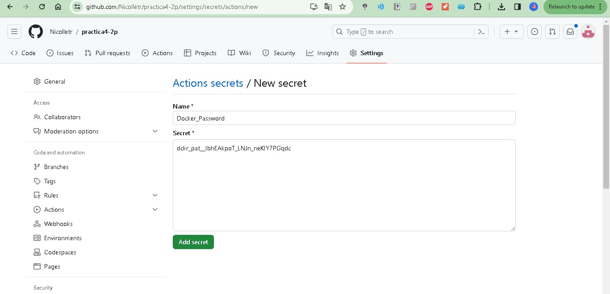
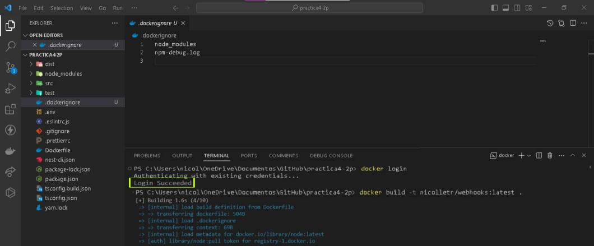

# Dockerización de Aplicación NestJS y GitHub Actions

Este repositorio ejemplifica la Dockerización de una aplicación NestJS y la implementación de un flujo de trabajo en GitHub Actions destinado a la construcción y despliegue de contenedores Docker.

## Procedimiento

### 1. Creación del Repositorio

Se crea un repositorio en GitHub, ya sea público o privado. 

### 2. Preparación del Código Fuente

Se realiza un commit con el código deseado.

### 4. Configuración de Secrets en GitHub

Se configuran los secrets DOCKER_USER y DOCKER_PASSWORD en la sección correspondiente de Secrets en el repositorio de GitHub.

### 5. Configuración del Token de Docker Hub

Se utiliza el nombre de usuario y clave (token) de Docker Hub para llenar los secrets DOCKER_USER y DOCKER_PASSWORD.
Se crea un Token en Docker (con el nombre Github-Actions) y se copia este Token generado en el secret DOCKER_PASSWORD.

### 6. Dockerización de la Aplicación

Se realiza la Dockerización de la aplicación NestJS, preferiblemente un servicio REST o GraphQL sin dependencias.

### 7. Verificación de la Construcción y Funcionamiento

Se asegura de que la imagen pueda ser compilada

Se hace el commit para que se hagan los builds automáticos 

### 8. Crear Acción de Imagen Docker

Configura un flujo de trabajo en GitHub Actions para generar la imagen Docker utilizando el archivo `docker-image.yml`.

#### Evidencias

- **El flujo de trabajo está configurado para realizar builds automáticos.**
  

- **Durante el guardado, se genera un nuevo build automáticamente.**
  

- **Build completado sin errores.**
  
